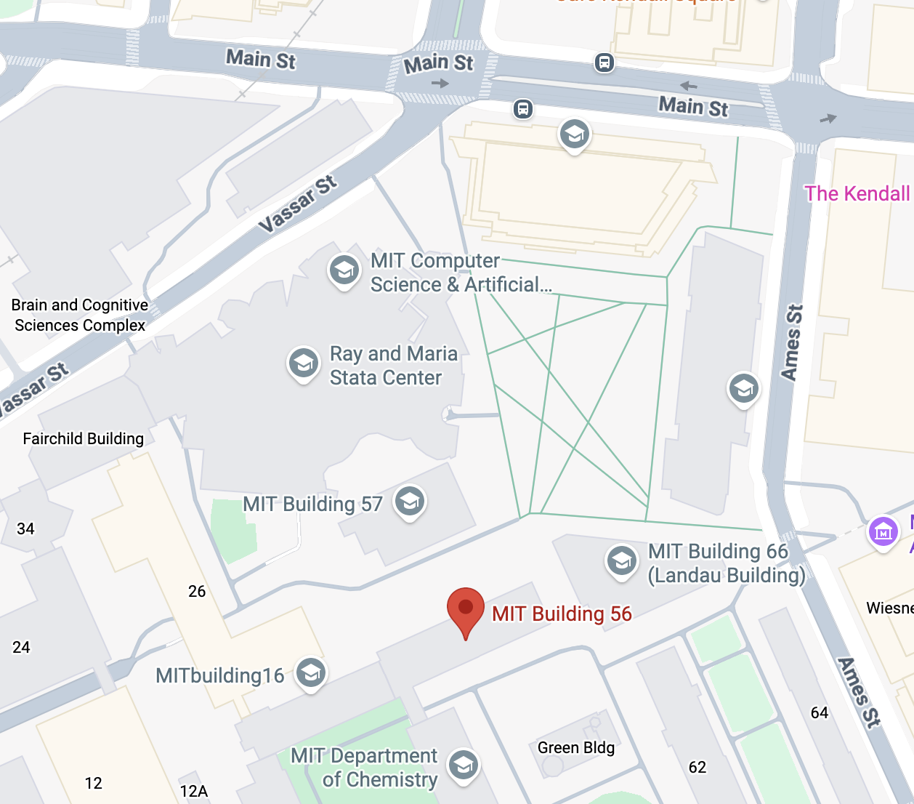

## Getting to MIT
- The [MBTA](https://ww.mbta.com) is the local transportation agency of the Greater Boston Area.
	- Boston Logan Airport is served by the Silver Line, which is free from the airport.
	- Long-distance buses arrive at South Station.
	- Amtrak arrives at either North Station or South Station.
	- Both North and South Stations are on subway lines.

- Parking
	- Parking information for visitors to MIT can be found [here](https://web.mit.edu/facilities/transportation/parking/visitors/public_parking.html).

## Venue
- Conference presentations and poster sessions will be held in 56-114 (Building 56, Room 114) at 21 Ames Street.
- The [interactive MIT campus map](https://whereis.mit.edu/?go=56) is quite helpful.
- Dinner on April 11 will be served in the Linguistics Department at the 8th floor lounge of Ray and Maria Stata Center (Building 32), 32 Vassar Street.
- Both locations are within a five minute walk from the Kendall/MIT subway stop on the Red Line.
